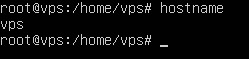
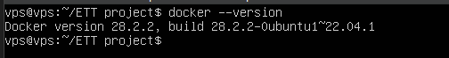
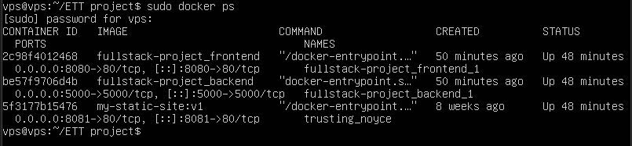
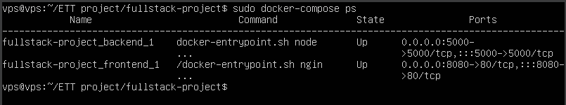
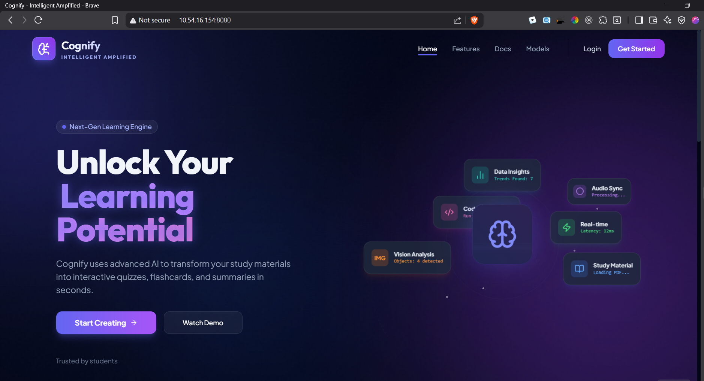
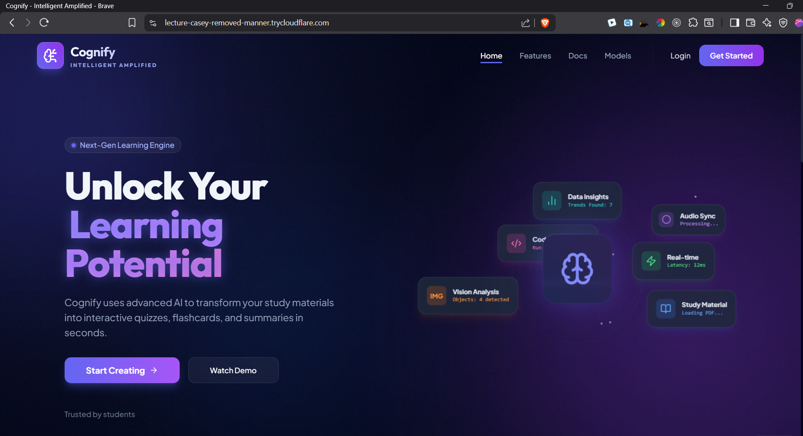

# Docker VM Full Stack Deployment

This project demonstrates the deployment of a **full-stack web application** using **Docker containers inside a Virtual Machine** and exposing the application to the internet using **Cloudflare Tunnel** without requiring a public IP address.

The system combines **virtualization, containerization, reverse proxy configuration, and cloud service integration**.

---

# Technologies Used

## Frontend

- React
- Vite
- Nginx

## Backend

- Node.js
- Express.js

## Infrastructure

- Docker
- Docker Compose
- Ubuntu Server
- VirtualBox

## Cloud Services

- MongoDB Atlas
- Cloudinary
- HuggingFace API
- OpenAI API
- Cloudflare Tunnel

---

# Project Architecture

```text
                Internet Users
                       |
                Cloudflare Tunnel
                       |
              Ubuntu Virtual Machine
                       |
                   Docker Engine
                       |
        ┌──────────────┴──────────────┐
        |                             |
Frontend Container             Backend Container
 (React + Nginx)              (Node.js + Express)
        |                             |
        └───────────────┬─────────────┘
                        |
                   MongoDB Atlas
```

The application runs inside an Ubuntu Virtual Machine where Docker manages the frontend and backend containers.  
Cloudflare Tunnel exposes the application securely to the public internet.

---

# Project Structure

```
docker-vm-fullstack-project
│
├── backend
│   ├── Dockerfile
│   ├── package.json
│   ├── server.js
│   └── ...
│
├── frontend
│   ├── Dockerfile
│   ├── nginx.conf
│   ├── src/
│   ├── public/
│   ├── package.json
│   └── vite.config.js
│
├── docker-compose.yml
│
├── docs
│   ├── architecture.md
│   ├── project-overview.md
│   ├── vm-setup.md
│   ├── docker-installation.md
│   ├── cloudflare-tunnel.md
│   └── deployment.md
│
├── screenshots
│   ├── vm-login.png
│   ├── docker-version.png
│   ├── docker-containers.png
│   ├── docker-compose-running.png
│   ├── website-home.png
│   └── public-access.png
│
│
└── README.md
```

---

# Deployment Steps

## 1 Clone the Repository

```bash
git clone <repository-url>
```

---

## 2 Start Docker Containers

```bash
docker compose up -d
```

This command builds and starts both frontend and backend containers.

---

## 3 Run Cloudflare Tunnel

```bash
cloudflared tunnel --url http://localhost:8080
```

Cloudflare will generate a **public URL**.

Example:

```
https://example.trycloudflare.com
```

---

## 4 Access the Website

Open the generated URL in your browser to access the deployed application.

---

# Screenshots
<!-- 
The **screenshots** directory contains images demonstrating:

- Virtual Machine setup
- Docker installation
- Running containers
- Application interface
- Public access via Cloudflare Tunnel -->

### Virtual Machine Setup



### Docker Installation



### Running Containers



### Docker Compose Deployment



### Website Interface



### Public Access via Cloudflare



---

# Key Features

- Full-stack web application deployment
- Docker containerization
- Virtual machine infrastructure
- Reverse proxy architecture using Nginx
- Cloud API integration
- Secure public access without public IP

---

# Future Improvements

Possible future improvements include:

- CI/CD pipeline integration
- Kubernetes container orchestration
- Custom domain configuration
- Automated deployment scripts

---

# License

This project is created for **educational and demonstration purposes**.